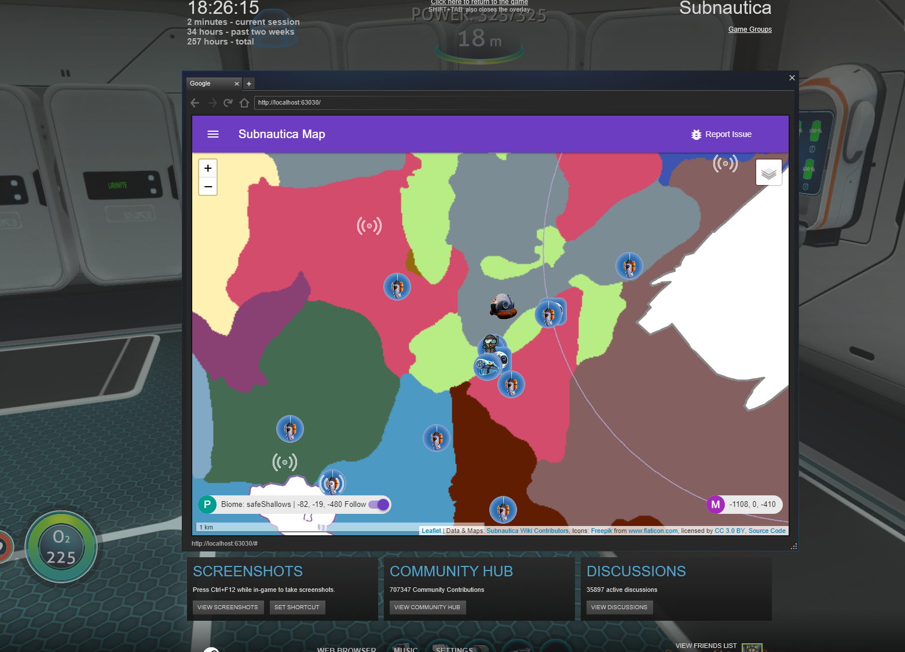
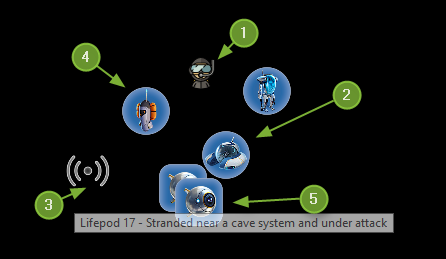
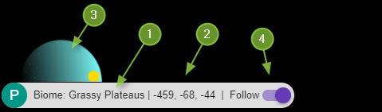
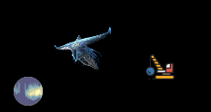
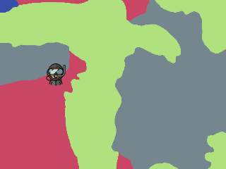
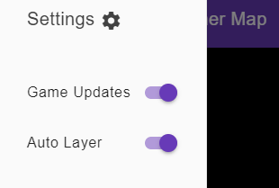
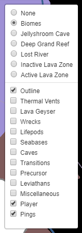

# Features

1. [Run In Overlay](#run-in-overlay)
1. [Live Game Data](#live-game-data)
1. [Points of Interest](#points-of-interest)
1. [Location Aware](#location-aware)
1. [No Spoilers Please!](#no-spoilers-please)

## Run in Overlay

Run in Steam Overlay or in browser on a second screen.

## Live Game Data

Live Updates from the tunning game:

1. Your Position
1. Your Vehicles
1. Signals
1. Beacons
1. Cameras

1. Current Biome
1. Current Position
1. Day/Night Indicator
1. Keep your position centred on the screen

## Points of Interest

Points of Interest taken from the Wiki:

* Leviathans
* Wrecks
* many more...

## Location Aware

Will automatically chose the best map for your location:

Don't worry, you can disable this behaviour:

## No Spoilers Please!

Display as much or as little information as you wish:

