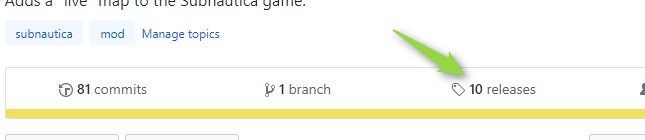
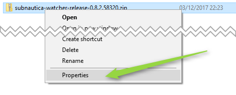
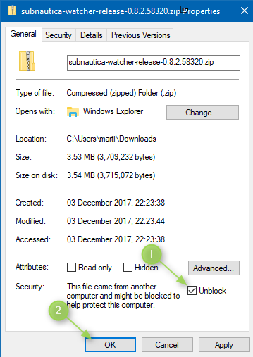
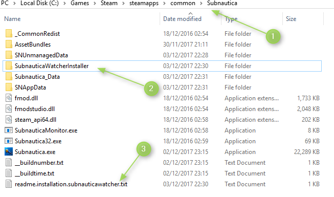
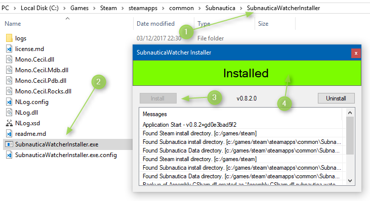

# The Really Detailed Installation Guide

__Warning:__ While attempts have been made to ensure this mod does not interfere with other mods, this cannot
be guaranteed.

__Warning:__ Only works on __Experimental__ branch.

## 1. Go To the Release Page:

## 2. Download the latest Release Zip:

## 3. Right-Click on the downloaded file and select "Properties":

## 4. Unblock the zip file

## 5. Copy Files from Zip to Subnautica Folder:

**If this is the first time you're installing this mod, you will not be asked to overwrite/replace anything.**

Updating the Mod will require you to replace some files.

## 6. If successfully copied you should see a new file and folder in your Subnautica Folder:

## 7. In the new SubnauticaWatcherInstaller folder run SubnauticaWatcherInstaller.exe

__Warning:__ You may need to repeat this step whenever Steam updates Subnautica.

**All Done**